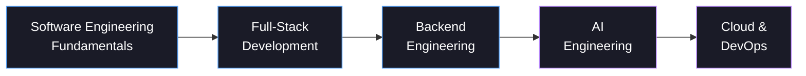

<div align="center">


<a href="https://github.com/mo-dallal">

</a>

📍 Nablus, Palestine

</div>

<br>

I build full-stack applications and backend systems, and I'm currently going deeper into AI engineering — most recently by shipping a local-LLM-powered resume analyzer and working through a structured AI/ML training track. I'd rather ship a small, well-scoped project than leave a big one half-finished.

<br>

## 🚀 Currently Building

```text
▸ Full-stack applications (React + Node/Express)
▸ Backend APIs & data-driven services
▸ AI-powered tools using local & hosted LLMs
▸ ML pipelines — from raw data to trained models
▸ Core software engineering fundamentals
```

<br>

## 🛠️ Tech Stack

<div align="center">


</div>

<br>

**Data & AI**
`Pandas` `scikit-learn` `XGBoost` `Streamlit` `Ollama (local LLMs)` `TF-IDF / Cosine Similarity`

**Databases**
`SQLite` `SQL Server (T-SQL)`

**Tooling**
`Swagger / OpenAPI` `Jupyter` `Netlify`

> Docker, CI/CD, and cloud platforms (AWS/Azure) are active learning areas, not daily tools yet — see *Currently Learning* below.

<br>

## 🧭 Engineering Journey



Every stage above is backed by a real, shipped project — not just intent.

<br>

## ⭐ Featured Projects

<table>
<tr>
<td width="26%"><b>🤖 AI Resume Analyzer</b></td>
<td>
Full-stack app that scores a resume against a job description and returns structured, actionable feedback — ATS-style scoring, skill-gap detection, section-level suggestions. Runs on a local LLM through Ollama, so it needs no paid API key.
<br><br>
<b>Stack:</b> TypeScript, full-stack, Ollama (local LLM)
<br>
<a href="https://github.com/mo-dallal/ai-resume-analyzer">Repository →</a>
</td>
</tr>
<tr>
<td><b>🔌 Task API</b></td>
<td>
A REST API for a to-do list, evolved from an in-memory prototype into a SQLite-backed service with search/filter/sort, stats endpoints, and interactive Swagger docs.
<br><br>
<b>Stack:</b> Node.js, Express, SQLite, Swagger
<br>
<a href="https://github.com/mo-dallal/-task-api">Repository →</a>
</td>
</tr>
<tr>
<td><b>📰 News Feed App</b></td>
<td>
A React news feed built to practice core frontend patterns — components, Context API, client-side routing, and REST integration — with simulated JWT auth that persists across page refreshes.
<br><br>
<b>Stack:</b> React, Context API, React Router, Tailwind CSS
<br>
<a href="https://github.com/mo-dallal/News-Feed-App">Repository →</a>
</td>
</tr>
<tr>
<td><b>🌌 Galaxy, Star & Quasar Classification</b></td>
<td>
Classifies astronomical objects from real Sloan Digital Sky Survey data using SVM, Random Forest, and XGBoost, with full EDA, feature engineering, and cross-validation.
<br><br>
<b>Stack:</b> Python, scikit-learn, XGBoost, Pandas
<br>
<a href="https://github.com/mo-dallal/Galaxy-Classification-SDSS">Repository →</a>
</td>
</tr>
<tr>
<td><b>📦 Olist ML Pipeline</b><br><sub>(MLOps training)</sub></td>
<td>
End-to-end pipeline that loads the Olist e-commerce dataset into a relational database, then builds a reproducible workflow to predict late deliveries — raw data to trained classifier.
<br><br>
<b>Stack:</b> Python, SQLite, scikit-learn
<br>
<a href="https://github.com/mo-dallal/MLOps-Task2">Repository →</a> · <a href="https://github.com/mo-dallal/Qafza-Training-Task-1-">Data-loading stage →</a>
</td>
</tr>
<tr>
<td><b>📚 Library Management System</b></td>
<td>
A C# console application modeling a library's core operations — books, members, borrowing, returns — built around clean OOP design.
<br><br>
<b>Stack:</b> C#, .NET, OOP
<br>
<a href="https://github.com/mo-dallal/Library-Management-System-">Repository →</a>
</td>
</tr>
</table>

<br>

## 📖 Currently Learning

**AI Engineering** — LLM-powered applications and prompt-driven workflows, building on a completed rule-based → classification → recommendation-engine track

**Cloud & DevOps** — Docker, CI/CD, and cloud fundamentals

**Backend depth** — authentication, testing, and API design beyond basic CRUD

**Software engineering fundamentals** — data structures, algorithms, system design

<br>

## 📊 GitHub Activity

<div align="center">


<br>


</div>

<sub>The animated graph above needs a one-time GitHub Action — see <code>snake.yml</code> in the files I've shared. Remove this section if you'd rather skip the setup.</sub>

<br>

## 💭 Beyond Code

When I'm not shipping a repo, I'm usually mid-way through a structured track — the DecodeLabs AI Engineering internship and an MLOps training program have been the last two rabbit holes, both of which fed directly into the projects above.

<br>

## 📫 Connect

<p>
<a href="https://www.linkedin.com/in/mostafa-dallal-6b130a25a/"></a>
<a href="mailto:mostafa.dallal2005@gmail.com"></a>
<a href="https://github.com/mo-dallal"></a>
</p>


